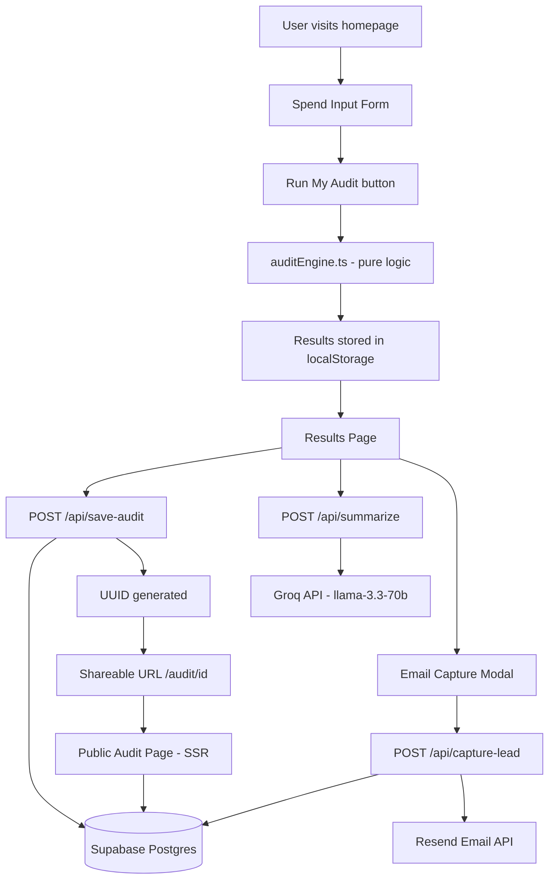

# ARCHITECTURE.md

## System Diagram

## Data Flow

1. User fills spend input form → selects tools, plans, spend, seats
2. Clicks "Run My Audit" → `runAudit()` in `auditEngine.ts` runs locally (no API call)
3. Result stored in `localStorage` → user redirected to `/results`
4. Results page loads → simultaneously:
   - POSTs to `/api/save-audit` → saves to Supabase → returns UUID
   - POSTs to `/api/summarize` → calls Groq API → returns 100-word summary
5. Share URL generated from UUID → `/audit/{uuid}`
6. User submits email → `/api/capture-lead` → updates Supabase record + sends Resend email
7. Public audit page (`/audit/[id]`) → SSR fetches from Supabase by UUID

## Why I chose this stack

**Next.js** — App Router gives us SSR for the public audit page (needed for OG tags), API routes eliminate need for a separate backend, and file-based routing maps cleanly to our pages.

**TypeScript** — Catches bugs at compile time. Especially useful for the audit engine where type safety on ToolEntry and AuditResult prevents runtime errors.

**Supabase** — Managed Postgres with a JS SDK. Free tier is generous. `jsonb` columns let us store dynamic tool/result data without a complex schema.

**Groq** — Free tier, OpenAI-compatible SDK, fast inference. Used instead of Anthropic API due to credit constraints. Llama-3.3-70b produces high quality summaries for this use case.

**Resend** — Simplest transactional email API. Single function call, free tier covers our volume.

**Vercel** — Zero-config Next.js deployment. Automatic preview deployments on every push.

**Tailwind + Shadcn/ui** — Shadcn gives us accessible, unstyled components. Tailwind handles all styling. No CSS files needed.

## What I'd change for 10k audits/day

1. **Add Redis caching** — Cache Groq API responses by audit hash to avoid redundant API calls for similar inputs
2. **Add RLS policies** — Re-enable Supabase Row Level Security with proper policies instead of disabling it
3. **Queue email sending** — Move Resend calls to a background job queue (e.g. Inngest) to avoid blocking the API response
4. **Add rate limiting** — Use Upstash Redis for per-IP rate limiting on all API routes
5. **Add indexes** — Add Postgres index on `audits.created_at` and `audits.email` for faster queries
6. **CDN for OG images** — Generate dynamic OG images with `next/og` for better social sharing