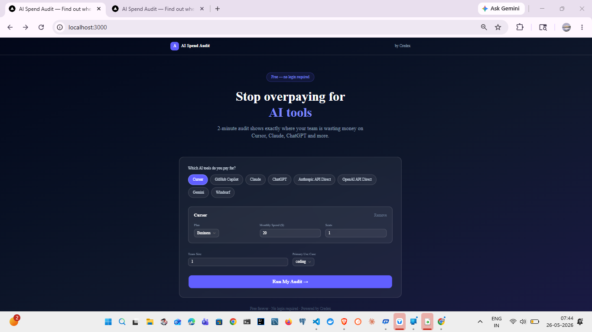
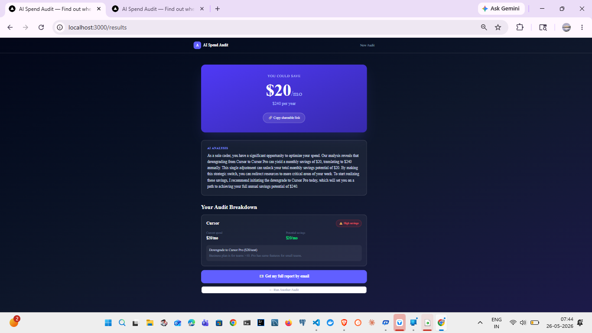
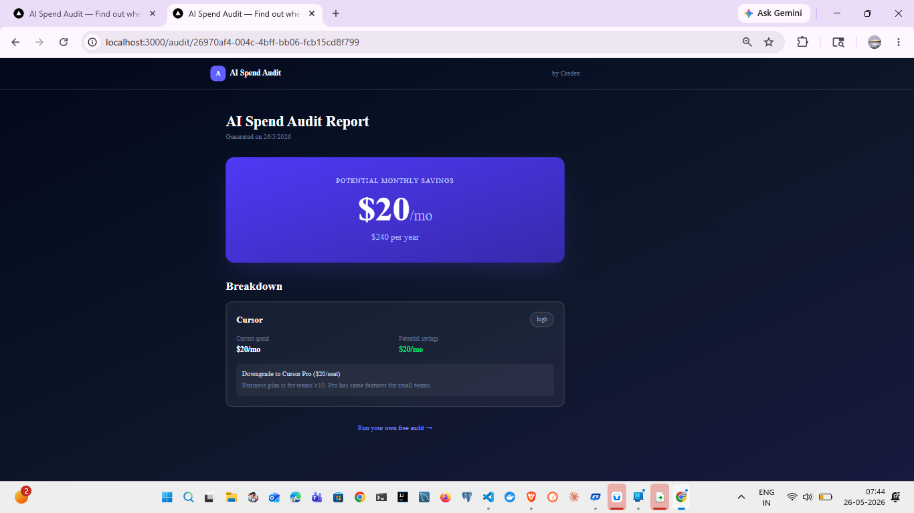

# AI Spend Audit

Free tool for startups to audit their AI tool spend. Input what you pay for Cursor, Claude, ChatGPT, GitHub Copilot and more — get an instant breakdown of where you're overpaying and how much you could save.

Built as a lead-generation tool for [Credex](https://credex.rocks) — a platform selling discounted AI infrastructure credits.

**Live URL:** https://credex-audit-pink.vercel.app

---

## Screenshots


> Take 3 screenshots and add them here or link a 30-second Loom recording

---

## Quick Start

### Install
```bash
git clone https://github.com/Prachi088/credex-audit
cd credex-audit
npm install
```

### Environment Variables
Create `.env.local`:
NEXT_PUBLIC_SUPABASE_URL=your_supabase_url
NEXT_PUBLIC_SUPABASE_ANON_KEY=your_supabase_anon_key
GROQ_API_KEY=your_groq_key
RESEND_API_KEY=your_resend_key

### Run locally
```bash
npm run dev
```

### Run tests
```bash
npm test
```

### Deploy
Push to GitHub — Vercel auto-deploys on every push to main.

---

## Decisions

**1. Next.js over React+Vite**
Needed SSR for Open Graph tags on dynamic shareable audit pages (`/audit/[id]`). Vite doesn't support SSR out of the box. Next.js App Router gave us API routes, SSR, and file-based routing in one package.

**2. Groq over Anthropic API**
Anthropic API requires paid credits. Groq offers free tier with llama-3.3-70b-versatile which produces comparable quality for 100-word audit summaries. Switching saved money during development and keeps the tool free to operate.

**3. Rule-based audit engine, not AI**
The assignment specifically tests knowing when NOT to use AI. Pricing rules are deterministic — "Cursor Business for 2 users wastes $40/mo" is a math problem, not a language problem. Hardcoded rules are more reliable, faster, and cheaper than prompting an LLM for every audit.

**4. localStorage for form persistence**
Form state survives page refreshes without a database round-trip. Simple, fast, no auth required. Tradeoff: doesn't sync across devices, but acceptable for a single-session audit tool.

**5. Disabled Supabase RLS for MVP**
Row Level Security blocked anon key inserts. For a 7-day MVP with no sensitive PII in the audits table, disabling RLS was the right tradeoff. Week 2 priority: add proper RLS policies.

---

## Tech Stack

- **Frontend:** Next.js 16, TypeScript, Tailwind CSS, Shadcn/ui
- **Backend:** Next.js API routes
- **Database:** Supabase (Postgres)
- **AI Summary:** Groq API (llama-3.3-70b-versatile)
- **Email:** Resend
- **Deployment:** Vercel
- **Tests:** Vitest
- **CI:** GitHub Actions

## Screenshots

**Homepage — Spend Input Form**


**Results Page — Audit Breakdown**


**Shareable Public Audit Page**


> Full demo: Run the audit at https://credex-audit-pink.vercel.app